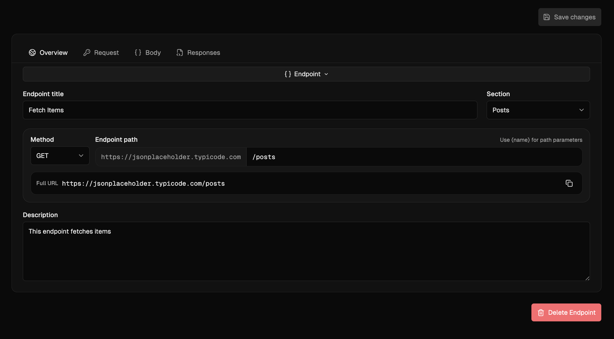
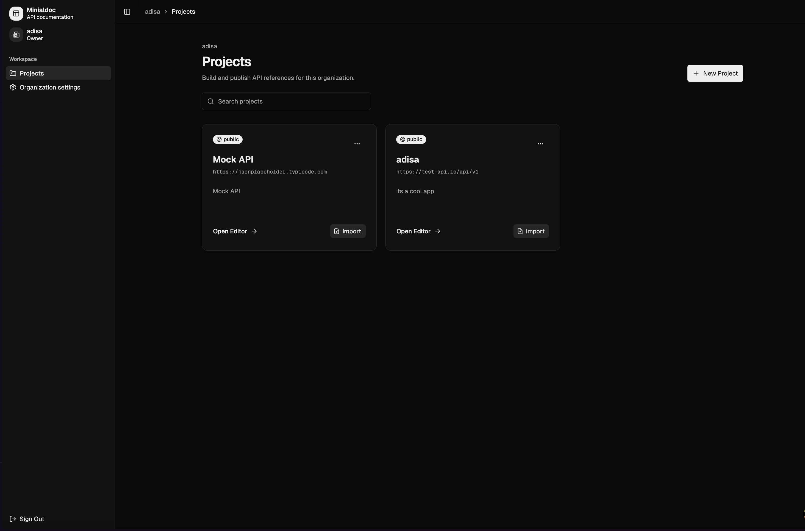
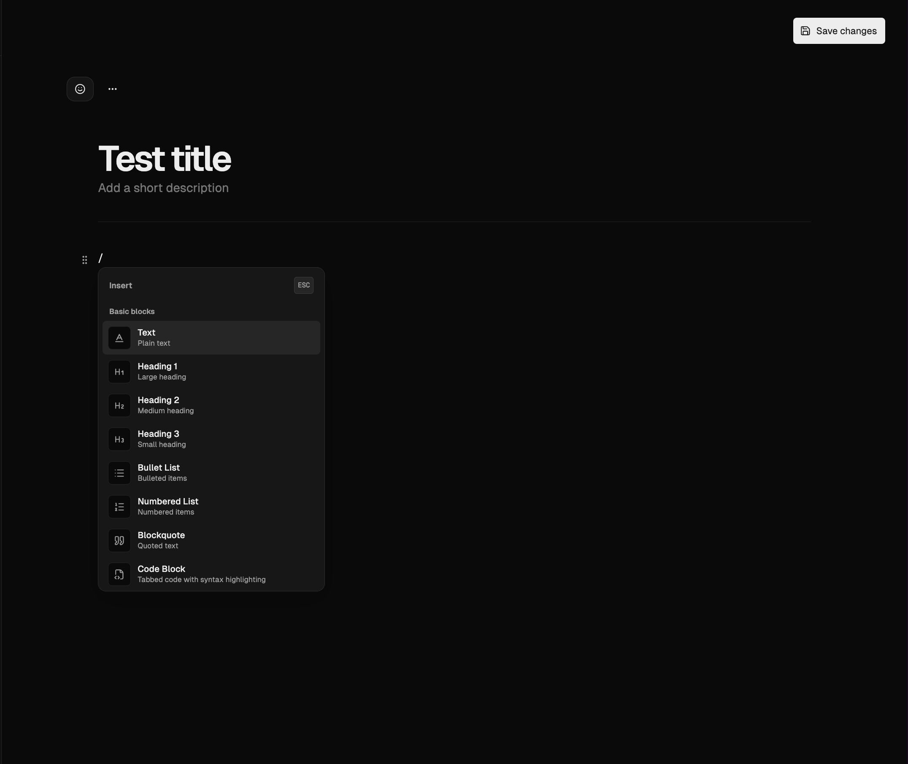
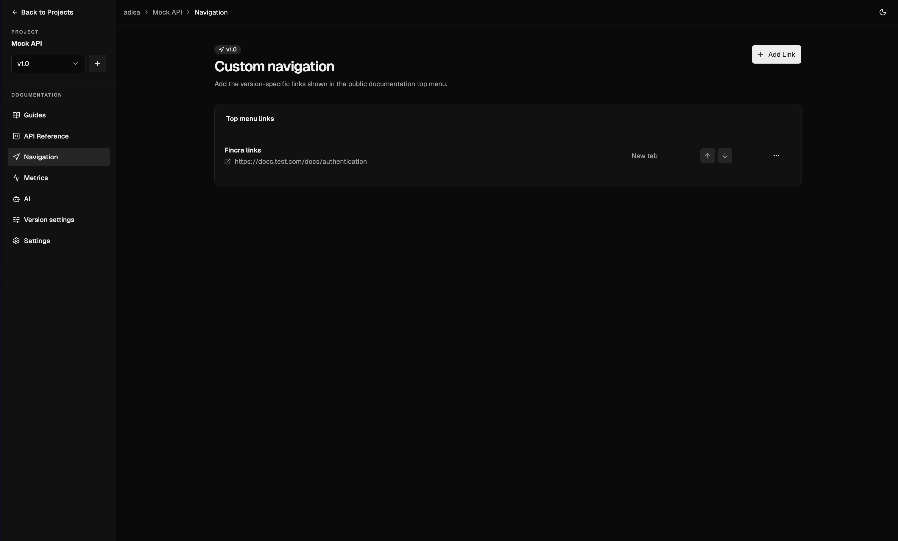
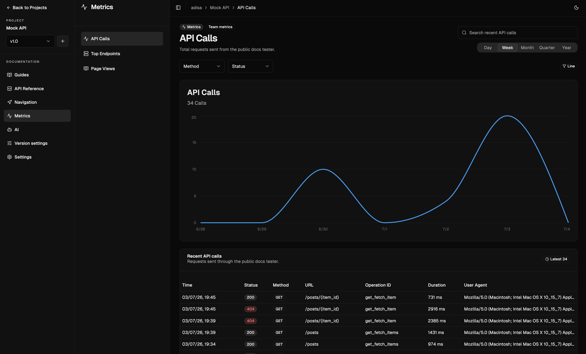
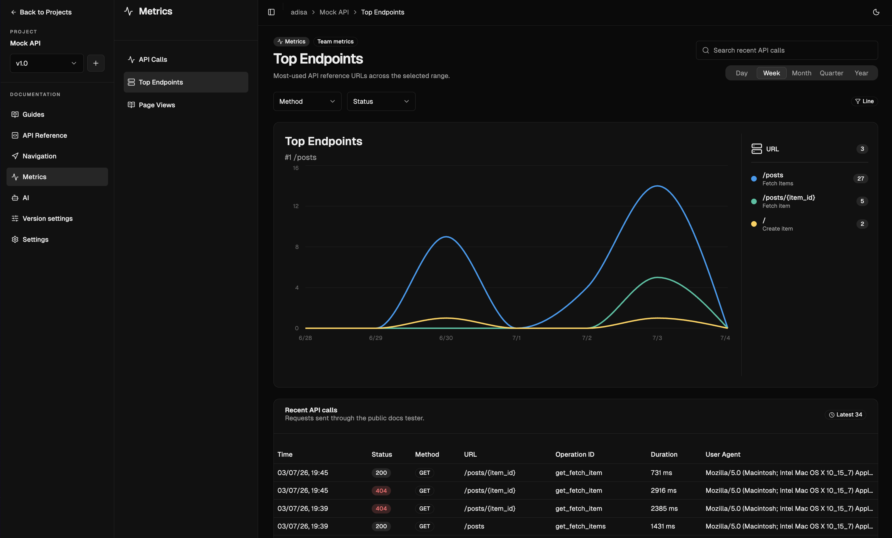
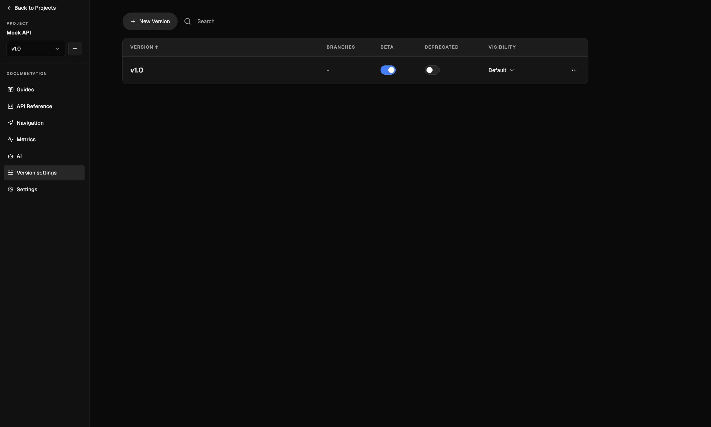
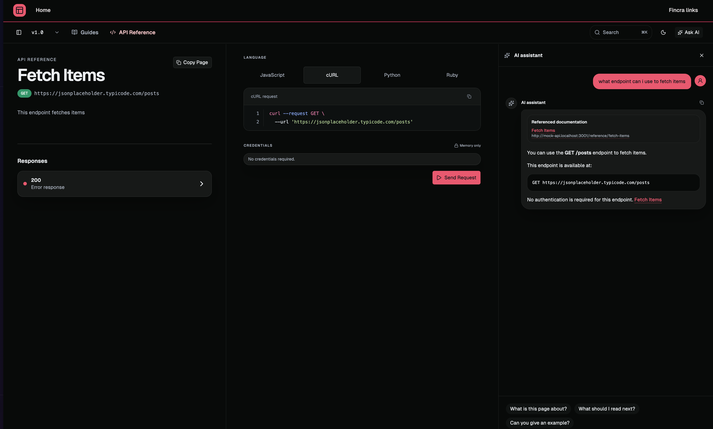

# openapidoc

API documentation without the operational clutter. Create, organize, import, and publish clear API references from one focused workspace. Built with TanStack Start, Convex, Better Auth, and the Geist design system.

[View the project on GitHub](https://github.com/oyeolamilekan/opendocs)



## Features

- **Structured documentation** — Organize every API into projects, sections, endpoint references, and standalone guides.
- **OpenAPI import** — Start from OpenAPI 3.0 or 3.1 JSON and YAML, then refine the result.
- **AI assistant** — Bring your own keys for OpenAI, Anthropic, Google, xAI, Groq, Mistral, or any OpenAI-compatible provider to draft and refine documentation.
- **Documentation versioning** — Run draft and published versions side by side, mark betas and deprecations, and pin a default.
- **Custom theming** — Pick a theme color, brand color, font, and layout style, then add your logo and favicon.
- **Try it out** — Readers can call documented endpoints directly from the public docs; calls are proxied through the app and recorded in analytics.
- **Agent-friendly exports** — Publish `agent.json`, `tools.json`, `openapi.json`, `llms.txt`, a read-only MCP server, Markdown exports, and one-click Markdown/text copies of every guide and endpoint page.
- **Private by default** — Keep work inside your organization, then publish documentation deliberately.
- **Team workspaces** — Invite members as owners, admins, or members and share projects from one organization.
- **Analytics** — Track API calls and page views per project with hourly and daily counters.

## Screenshot Gallery

openapidoc has two main surfaces: a private workspace for writing and maintaining API documentation, and a public documentation experience for readers. The reference editor uses a Notion-style block editor.

| Reference editor                                              | API reference editor                                                 |
| ------------------------------------------------------------- | -------------------------------------------------------------------- |
|  |  |

| Reference editor with Notion-style editor                       | Custom navigation links                                            |
| --------------------------------------------------------------- | ------------------------------------------------------------------ |
|  |  |

| Metrics overview                                                | Metrics detail                                                      |
| --------------------------------------------------------------- | ------------------------------------------------------------------- |
|  |  |

| Manage versions                                                            | Public reference with AI                                                           |
| -------------------------------------------------------------------------- | ---------------------------------------------------------------------------------- |
|  |  |

## Prerequisites

- [Node.js](https://nodejs.org/) 20+ and [Bun](https://bun.sh/) 1.1+
- A [Convex](https://convex.dev) account (free tier works)

## Setup

### 1. Clone and install

```bash
git clone <your-repo-url> openapidoc
cd openapidoc
bun install
```

### 2. Configure environment variables

Copy the example file and fill in your values:

```bash
cp .env.example .env.local
```

Required variables in `.env.local`:

| Variable                       | Required | Description                                                               |
| ------------------------------ | -------- | ------------------------------------------------------------------------- |
| `CONVEX_DEPLOYMENT`            | yes      | Convex deployment name (set after `convex init`)                          |
| `VITE_CONVEX_URL`              | yes      | Convex deployment URL                                                     |
| `VITE_CONVEX_SITE_URL`         | yes      | Convex HTTP actions URL, ending in `.convex.site`                         |
| `VITE_SITE_URL`                | yes      | Public URL of this TanStack Start app, e.g. `http://localhost:3000`       |
| `VITE_PUBLIC_DOCS_ROOT_DOMAIN` | yes      | Root domain for public documentation subdomains. Use `localhost` locally. |
| `AI_GATEWAY_API_KEY`           | optional | Vercel AI Gateway key used by the default Gateway runtime                 |
| `AI_KEY_ENCRYPTION_SECRET`     | optional | Server-only secret used to encrypt project-level AI provider API keys     |

Set these Convex-side secrets with `bunx convex env set` (do **not** put them in `.env.local`):

```bash
bunx convex env set BETTER_AUTH_SECRET="$(openssl rand -hex 32)"
bunx convex env set SITE_URL=http://localhost:3000
bunx convex env set BETTER_AUTH_TRUSTED_ORIGINS=http://localhost:3000
```

### 3. Initialize Convex

```bash
bunx convex init
bunx convex dev
```

`convex init` links a deployment and writes `CONVEX_DEPLOYMENT` and `VITE_CONVEX_URL` into your environment. `convex dev` starts the backend, applies the schema, and watches for changes.

### 4. Generate routes and run

```bash
bun run generate-routes
bun run dev
```

`dev` starts the Convex backend and the Vite dev server concurrently. The app is at `http://localhost:3000`.

## Scripts

| Command                   | Description                                  |
| ------------------------- | -------------------------------------------- |
| `bun run dev`             | Start Convex and the web dev server together |
| `bun run dev:web`         | Start only the Vite dev server               |
| `bun run dev:convex`      | Start only the Convex dev server             |
| `bun run build`           | Build the production bundle with Vite        |
| `bun run preview`         | Preview the production build                 |
| `bun run typecheck`       | Run `tsc --noEmit`                           |
| `bun run test`            | Run Vitest                                   |
| `bun run generate-routes` | Regenerate TanStack Router route files       |

## Architecture

| Layer         | Technology                                                   |
| ------------- | ------------------------------------------------------------ |
| Frontend      | TanStack Start, TanStack Router, React 19, Tailwind CSS v4   |
| Backend       | Convex (schema, mutations, queries, actions)                 |
| Auth          | Better Auth via `@convex-dev/better-auth` (email + password) |
| Editor        | Tiptap (prose, parameters, request bodies, sample responses) |
| AI            | Vercel AI SDK + provider keys (`@ai-sdk/react`, `ai`)        |
| Icons         | lucide-react                                                 |
| UI primitives | shadcn/ui                                                    |

### Where things live

- `src/routes/` — file-based routes (landing, auth, app workspace, public docs)
- `src/routes/api/` — server API routes for AI chat, auth proxy, and the endpoint tester proxy
- `src/components/` — React components (editor, AI panel, cards, dialogs)
- `convex/` — backend: schema, auth, projects, endpoints, guides, versions, AI, analytics, OpenAPI import
- `src/lib/agent-export.ts`, `src/lib/mcp-server.ts`, and `src/lib/markdown-export.ts` — public agent manifests, MCP discovery/tools/resources, retrieval payloads, and Markdown/text export formatting
- `src/styles.css` — Geist design tokens, documentation theme overrides, editor styles
- `DESIGN.md` — full Geist design system reference

For a walkthrough of how the product works, see [guide.md](./guide.md). For the data model reference, see [schema.md](./schema.md).

## Deploy

The build is a self-contained Node server powered by Nitro. The output goes to `.output/`.

```bash
bun run build
node .output/server/index.mjs
```

Push the `.output/` directory to any Node-compatible host (Vercel, Fly.io, Render, your own VPS). For host-specific presets, see [the Nitro deployment docs](https://v3.nitro.build/deploy).

Set the production Convex environment variables the same way as above, and make sure:

- `VITE_SITE_URL` and `SITE_URL` point at your production app URL
- `VITE_PUBLIC_DOCS_ROOT_DOMAIN` is your apex domain (e.g. `openapidoc.app`)
- `BETTER_AUTH_TRUSTED_ORIGINS` lists your production origin
- Convex env vars (`BETTER_AUTH_SECRET`, `SITE_URL`, `BETTER_AUTH_TRUSTED_ORIGINS`) are set on the production deployment with `bunx convex env set --prod`
